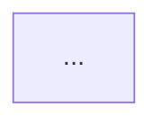
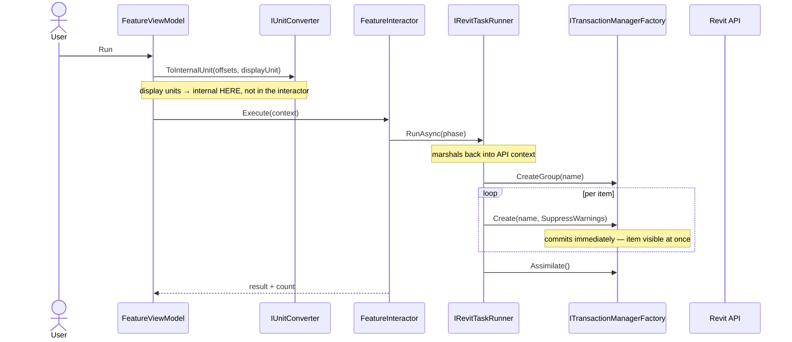
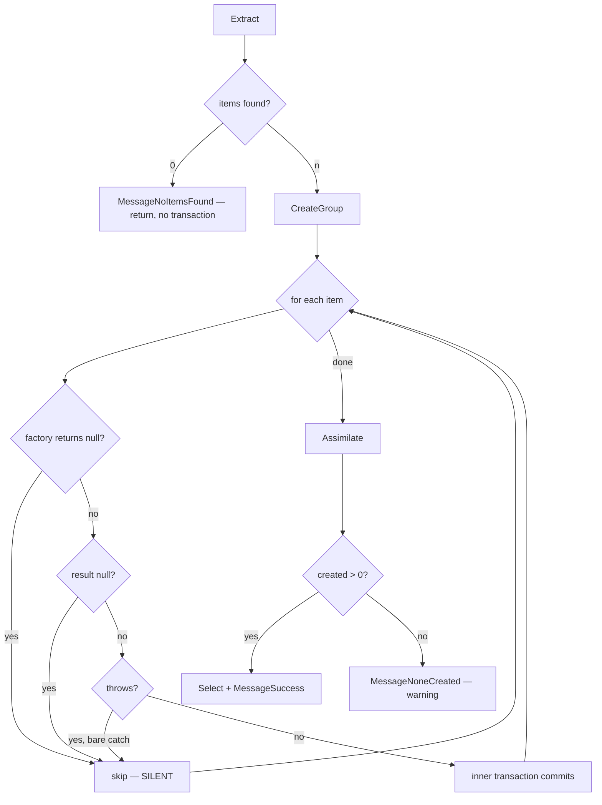

# reference: template feature doc + ví dụ diagram

Nội dung template viết bằng **tiếng Anh** vì nó là văn bản đi vào repo của project; phần hướng dẫn quanh
nó là tiếng Việt. Project dùng ngôn ngữ khác cho `docs/` thì đổi theo project.

## Nền tảng

Cấu trúc lấy từ ba chuẩn, mỗi chuẩn một việc:

| Chuẩn | Lấy gì |
|---|---|
| [Diátaxis](https://diataxis.fr/) | Luật **không trộn** *reference* với *explanation* trong cùng một section. `## Contract` là reference (tra cứu, là căn cứ). `## Behaviour` là explanation (hiểu vì sao). Trộn vào nhau thì cả hai khó tin. |
| [C4 model](https://simonbrown.je/) | **Một mức trừu tượng một diagram.** `## Flow` ở mức component (layer gọi layer). `flowchart` trong `## Behaviour` ở mức trong-một-phase. Không vẽ cả hai vào một hình. |
| ADR (Nygard) | Quyết định ra file riêng, không nhét vào doc hành vi. |

Đối tượng đọc ở đây là **người sắp sửa code này** (hoặc agent), không phải người dùng sản phẩm — nên trong
4 loại của Diátaxis chỉ có 2 loại có nghĩa. Không có *tutorial*, không có *how-to*.

## Template

````markdown
# {Feature}

{2–3 dòng: nó làm gì. Rồi một đoạn: người dùng bấm gì, thấy gì.}

## Contract

Change anything in this section and you are changing the requirement, not the implementation.

### Input

| Input | Source | Default | Notes |
|---|---|---|---|
| `name` | where it comes from | value | **unit if numeric** |

### Output

{Cái gì thay đổi trong hệ thống. Kể cả tác dụng phụ: gì được chọn, gì vào log, undo trông ra sao.}

### Invariants

- **{Điều không được phá}** — {hậu quả nếu phá, cụ thể và có thật}

### Named failure modes

| Name | Trigger | Behaviour |
|---|---|---|
| `MessageX` | condition | what the user sees |
| *(unnamed)* **silent skip** | condition | dropped, no message, no log |

## Flow

{Một câu: hình dạng đặc thù của feature này, và nó khác feature kia ở đâu.}

```mermaid
sequenceDiagram
    ...
```

## Behaviour

{Chỉ cái code không nói rõ.}

### {Phase} — {nhánh quyết định & đường thất bại}



{Hệ quả thực tế của những nhánh đó, viết bằng số nếu được: "45 vào, 30 ra, không nói gì về 15".}

## What a test should prove

{Đang phủ gì, lệnh chạy, và cái gì khiến test đó giòn.}

**Gaps.** {Mỗi chỗ chưa phủ + có cần môi trường đặc biệt không.}

## Related

- [{doc khác}](...) — {vì sao liên quan}
- ADR: {nếu có}
- Symbols for `codegraph explore`: `Name1 Name2 Name3`
````

## Ví dụ 1 — `sequenceDiagram`, đường gọi xuyên layer

Đây là diagram graph không dựng được: call qua DI generic và qua binding UI không thành edge trong AST.
Đánh dấu tường minh những hop đó.



Luật khi vẽ:

- Participant là **type/interface thật**, không phải nhãn chung chung như "Service".
- `Note over` cho ba thứ: hop mà graph không thấy, chỗ đổi đơn vị, chỗ đổi thread/context.
- `loop` khi có vòng lặp — nó cho biết transaction nằm trong hay ngoài vòng, thứ quyết định undo.
- Đừng vẽ mọi lời gọi. Vẽ những lời gọi mà đọc code sẽ **đoán sai**.

## Ví dụ 2 — `flowchart TD`, nhánh quyết định và đường thất bại

Mục tiêu: nhìn một giây thấy mọi đường dẫn tới `skip — SILENT`.



Luật khi vẽ:

- **Mỗi silent skip một node**, và cho tất cả chúng chụm vào một node `skip — SILENT`. Ba mũi tên vào một
  ô nói lên nhiều hơn ba câu văn.
- Nhãn cạnh là **điều kiện thật**, không phải "ok"/"fail". `|yes, bare catch|` hơn `|error|`.
- Nhánh khác nhau về mức nghiêm trọng thì viết ra: `MessageNoneCreated — warning`, không chỉ
  `MessageNoneCreated`.
- Đừng vẽ happy path dài. Vẽ chỗ rẽ.

## Cú pháp: chỗ hay vỡ

| Vấn đề | Cách làm |
|---|---|
| Xuống dòng trong node/note | `<br/>`, không phải `\n` |
| `<`, `>`, `{`, `}`, `(`, `)` trong nhãn node | Bỏ chúng ra, hoặc bọc nhãn trong `"..."`. `GetService<T>` trong `[...]` sẽ làm vỡ parse |
| `:` trong tên participant | Được, nhưng tránh dùng trong nhãn message |
| Generic C# | Viết `GetService ILogger` thay vì `GetService<ILogger>` |
| Muốn vẽ C4 | **Đừng dùng `C4Context`** — experimental, và GitHub không render. Dùng `flowchart` với subgraph |
| Đổi màu, style tuỳ biến | Đừng. Mặc định đọc được ở cả light và dark theme; màu hardcode thì không |

## Checklist trước khi coi là xong

- [ ] Mọi dòng trong `## Contract` đã đối chiếu code bằng `codegraph`
- [ ] Mọi mũi tên trong `sequenceDiagram` là lời gọi thật, đúng thứ tự
- [ ] Mọi silent skip có một node trong `flowchart`
- [ ] `## Spec` và `## Plan` đã xoá hết
- [ ] Không còn `- [ ]` nào sót lại
- [ ] Không có câu nào chỉ nhắc lại signature
- [ ] Mỗi gap trong `## What a test should prove` nói rõ có cần môi trường đặc biệt không
- [ ] Chỗ nào lệch giữa doc và code thì đã **báo ra**, không tự sửa bên nào
